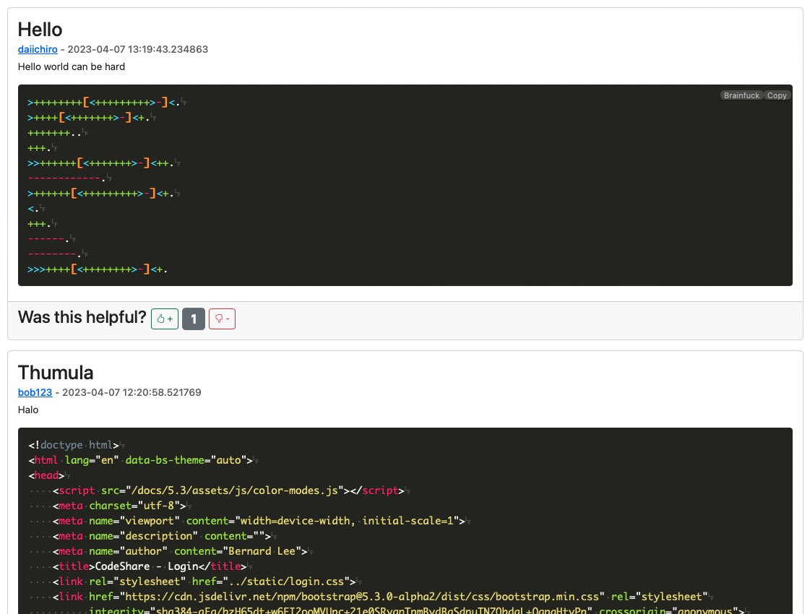

# Unit 4 Project: Code Sharing Social Media

[^1]

[^1]: "a japanese person suffering in coding in front of a laptop in the form of an oil painting" by DALL E 2, Open AI, Accessed 9th April 2023

## Criteria A: Planning

## Problem definition(Client identification)

I am a student at a high school in Karuizawa. Me and a half of my grade take Computer Science as a subject in the International Baccalaureate Diploma Programme. We often times have to share code in class and especially outside of class. We used to rely on platforms like Google Chat and Messenger to copy and paste short pieces of code at a time. It was not a very organised and effective solution as it made crediting code hard. Not to mention, sharing code over chat platforms make it very hard to add description to the code without making the chat very long and inlegible for looking back. Everyone posts their code in the community as well which makes it hard for other users to differentiate between good, working code and code that needs fixing. As such, there was a need for an consolidated solution for everyone in my class to share code and the class decided on a social media styled website that could represent code with correct syntax formatting and indentations shown.(See evidence of consultation in Appendix 1)

## Proposed Solution

Considering the client's requirements, an adequate solution would be social-media styled website that can store data inside a database. The most common tools for web development are Javascript, HTML, CSS[^8]but Javascript is a client-side language, which means that code is executed on the user's browser. This can make it vulnerable to attacks like cross-site scripting (XSS). To remedy this, Python would be an adequate programming language for that as it is not a client-side language, open sourced, mature and excells at memory management[^2]. To host the webiste, Flask would be an adequate choice as it is highly scalable, making it fit to the client's need for a school use website without overcomplicating resources[^3].For the database, SQLite would be a good fit as the data we are fitting is not very large in number and SQLite, with its embedded,serverless nature[^4], can reduce the use of computing resources while running the website, not to mention higher speeds. To interface with the SQLAlchemy is the choice to go as it has improved performance and is protected against security attacks[^5]. As for the user interface for the website, Bootstrap 5 is recommended for its dynamic scaling abilites to scale automatically for different devices[^6].To keep the website and their users secure, JSON web tokens are used because they are resistant to security attacks[^7] and can prevent malicious users from modifying the key to access unauthorized content.

[^2]: Python Geeks. “Advantages of Python: Disadvantages of Python.” Python Geeks, 26 June 2021, https://pythongeeks.org/advantages-disadvantages-of-python
[^3]: “6 Reasons Why Flask Is Better Framework for Web Application Development.” *Able*, https://able.bio/hardikshah/6-reasons-why-flask-is-better-framework-for-web-application-development--cd398f73.
[^4]: S, Ravikiran A. “What Is Sqlite? and When to Use It?” *Simplilearn.com*, Simplilearn, 16 Feb.2023, https://www.simplilearn.com/tutorials/sql-tutorial/what-is-sqlite.
[^5]:  Uwase, Ange. “Here Is the Reason Why SQLAlchemy Is so Popular.” Medium, 8 Feb.2021,https://towardsdatascience.com/here-is-the-reason-why-sqlalchemy-is-so-popular-43b489d3fb00#:~:text=SQLAlchemy%20is%20the%20ORM%20of.
[^6]: Pratikasha Shinde. “6 Reasons to Use Bootstrap 5 for Better UI Development – Blog.” *Jade Global*, 6 Oct. 2021, https://www.jadeglobal.com/blog/6-reasons-use-bootstrap-5-better-ui-development.
[^7]: “What Is JWT?: Akana by Perforce.” *Akana*, https://www.akana.com/blog/what-is-jwt#:~:text=Why%20Use%20JWT%3F,was%20signed%20by%20the%20issuer.
[^8]: “11 Most in-Demand Programming Languages in 2023.” *Berkeley Boot Camps*, 5 Jan. 2023, https://bootcamp.berkeley.edu/blog/most-in-demand-programming-languages/. 

### Design statement

I will design a social media platfom on a website built with Flask, Bootstap, HTML and CSS which stores data in an SQLite database for me and my classmates. This website will allow me and my classmates to post code and descriptions of them accordingly, with a like/dislike system to moderate content. Everything is secured under a hashed login system to keep user data secure. It will take approximately 1 month to complete and will be evaluated according to criterias below:

## Success Criteria

1. The website must keep users seperately with an encrypted login system
1. The website must be able to represent code with the correct syntax highlighting for the appropriate language and the correct indentations
1. The website must allow posting of code and description
1. Users should be able to like/dislike certain posts to increase authenticity of posted content
1. The website will be able to sort the posts by user/amount of likes/time posted
1. The website should allow for the changing of passwords per user

# Criteria B: Design

## System Diagram

​	

**Fig.1** *System diagram of the Website*

## Data Storage


**Fig.2** *ER diagram of the Website

### Example of Data Entries


**Fig.3** *Example of data entry in the Post table*


**Fig.4** *Example of data entry in the User table*

## UML Diagram


**Fig.5** *UML Diagram of the website

## Wireframe


**Fig.6** *Wireframe of the website*

## Record of Tasks

| Task No | Planned Action                                   | Planned Outcome                                              | Time estimate | Target completion date | Criterion |
| ------- | ------------------------------------------------ | ------------------------------------------------------------ | ------------- | ---------------------- | --------- |
| 1       | Planning: First Meeting with client              | Start collecting the context of the problem and research on current solutions | 3min          | March 28th             | A         |
| 2       | Planning: Defining problem and proposed solution | Start on refining client's requirements and tools needed     | 2 hr          | March 29th             | A         |
| 3       | Initializing codebase                            | To have the base environment of program ready for coding     | 1 hr          | March 29th             | B         |
| 4       | Planning : Second Meeting with client            | Decided success criteria                                     | 5 min         | March 30th             | A         |
| 5       |                                                  |                                                              |               |                        |           |
| 6       |                                                  |                                                              |               |                        |           |
| 7       |                                                  |                                                              |               |                        |           |
| 8       |                                                  |                                                              |               |                        |           |
| 9       |                                                  |                                                              |               |                        |           |
| 10      |                                                  |                                                              |               |                        |           |
| 11      |                                                  |                                                              |               |                        |           |
| 12      |                                                  |                                                              |               |                        |           |
| 13      |                                                  |                                                              |               |                        |           |
| 14      |                                                  |                                                              |               |                        |           |
| 15      |                                                  |                                                              |               |                        |           |
| 16      |                                                  |                                                              |               |                        |           |
| 17      |                                                  |                                                              |               |                        |           |
| 18      |                                                  |                                                              |               |                        |           |
| 19      |                                                  |                                                              |               |                        |           |
| 20      |                                                  |                                                              |               |                        |           |
| 21      |                                                  |                                                              |               |                        |           |
| 22      |                                                  |                                                              |               |                        |           |
| 23      |                                                  |                                                              |               |                        |           |
| 24      |                                                  |                                                              |               |                        |           |
| 25      |                                                  |                                                              |               |                        |           |
| 26      |                                                  |                                                              |               |                        |           |
| 27      |                                                  |                                                              |               |                        |           |
| 28      |                                                  |                                                              |               |                        |           |
| 29      |                                                  |                                                              |               |                        |           |
| 30      |                                                  |                                                              |               |                        |           |

## Flow Diagrams

### Token System


**Fig.7** *Flow Diagram of the token system* This diagram shows how users can authenticate in my website with JWT with expiry time. This ensures that users' data is kept safe and no unauthorized access would occur.

### Sorting


**Fig.8** *Flow Diagram of sorting system* This flow diagram demonstrates the ability to sort posts by different metrics.

### Like System

 

**Fig.9** *Flow diagram for adding and removing likes* This flow diagram demonstrates how the system for adding like/dislike works.

## Test Plan

| Type                 | Description                | Process                                                      | Anticipated Outcome                                          |
| -------------------- | -------------------------- | ------------------------------------------------------------ | ------------------------------------------------------------ |
| Unit Testing         | User Registration          |                                                              |                                                              |
| Unit Testing         | User Login                 |                                                              |                                                              |
| Unit Testing         | Logout                     |                                                              |                                                              |
| Integration Testing  | Login and Registration     |                                                              |                                                              |
| Unit Testing         | Changing Password          |                                                              |                                                              |
| Unit Testing         | Adding new post            |                                                              |                                                              |
| Unit Testing         | Like/Dislike a post        |                                                              |                                                              |
| Intergration Testing | Adding Post / Viewing Post |                                                              |                                                              |
| Unit Testing         | Sorting System             |                                                              |                                                              |
| Code Review          | Reviewing Code             | Going through the code and making sure unused parts are removed, variables are named properly and comments are placed appropriated | Easy to understand and easy to debug code for future development. |

# Criteria C: Development

## Existing Tools

| Software/Development Tools | Coding Structure Tools      | Libraries    |
| -------------------------- | --------------------------- | ------------ |
| PyCharm                    | Object Oriented Programming | Datetime     |
| VS Code                    | SQL requests                | Flask        |
| Python                     | Databases                   | Jinja2       |
| Javascript                 | Encryptions                 | Passlib.hash |
| HTML                       | For Loops                   | dotenv       |
| CSS                        | If-then-else statements     | Jose         |
| SQLite                     | Object Relation Mapping     | Sqlalchemy   |
| SQLAlchemy                 |                             | Prism.js     |
| JSON Web Tokens            |                             |              |
| Flask                      |                             |              |
| Bootstrap 5                |                             |              |
| ChatGPT                    |                             |              |
| Github Copilot             |                             |              |

## List of Techniques

1. Object Oriented Programming(OOP)
2. Object Relation Mapping(ORM): SQLAlchemy
3. Flask Library
4. Bootstrap Library
5. Javascript/Python inside HTML
6. CSS Styling
7. For loops
8. if statements
9. Password Hashing
10. Token-based authentication
11. Interacting with Databases
12. Arrays and Lists
13. Text Formatting

## Development

### Cards

When researching about social media website designs, I noticed that most websites prefer a card based designed to better guide the user and make the overall interface clearer for reading. Thus, I chose to employ a card-based design for my login screen. Here is the code snippet:

```html
    <div class="card" style="width: 18rem;">
      {# Code of the sign in fields inside the card is omitted for demonstration puposes#}
</div>
```

As you can see above, the whole sign in form is house inside a `<div>` element which inherits from class `card` from the bootstrap library. This automatically houses the elements inside the `<div>` align to the center and automatically creates a border for the sign in form so the user's attention is immediately grabbed towards it


**Fig.10**  *Screenshot of the login page, as mentioned above this employs a card design in order to reduce clutter on the screen and lead the user to the most important element which is the login fields.*

### Modals

Throughout this program, the input of certain informations is often needed in instances stated in the success criterias like registering new users, changing passwords, and editing posts. If we redirect the user to a new page everytime one of those actions are being executed, the website will become very cluttered and unintuitive. As such, I have chosen to use a modal which is a web page element that displays in front of and deactivates all other page content. To return to the main content, the user must engage with the modal by completing an action or by closing it. Modals are often used to direct users’ attention to an important action or piece of information on a website or application. For example, when the user clicks on the change password button, it triggers a modal with the following code:

```html
<button type="button" class="btn btn-primary w-100" data-bs-toggle="modal" data-bs-target="#changePasswordModal">
```

When the button is defined, it is set to toggle the modal defined below:

```html
<div class="modal fade" id="changePasswordModal" tabindex="-1" aria-labelledby="changePasswordModalLabel" aria-hidden="true">
                            <div class="modal-dialog">
                                {# Code omitted for demonstrative purposes#}
                            </div>
                        </div>
```

The modal is created by inheriting from the `modal` class from the Bootstrap 5 library. Inside the modal, we can house ordinary html elements like forms and text fields.


**Fig.11**  *Screenshot of the modal pop up.*

As you can see, the content around the modal is darkened and directs the user's attention there. 

### JSON Web Tokens

One of the success criterias was to have a hashed login system. One issue I had after the user logged in which was that I couldn't recognize the user after the inital login process. I wanted to use cookies to store the user ids. I realized soon afterwards that the cookies can be easily modified in flight and makes the hashed passwords useless. Soon I came across session tokens. Session tokens are encrypted token that contain information about the user. They expire after a time designated by the developer and can be used to protect the user as it is hashed using a special secret key that only the developer has control over. Currently, once the user succesfully logs in with the right username and password. The main key function on the flask endpoint executes a `create_token` function from the `token_management.py`. The token is created as follows:

```py
#This functions takes in the username and the how long the token should last in minutes
def create_token(username, token_duration): 
  	#This adjusts the starting time of counting the token expiry to keep constenticy across platforms
    unix_timestamp = (datetime.now() - datetime(1970, 1, 1)).total_seconds()
    #This line sets the expiry time of the token
    ttl = token_duration * 60 + unix_timestamp
    #token format = encoded(username, datetime) token_duration in minutes
    token  = jwt.encode({'username': username, 'datetime': ttl}, token_encryption_key, algorithm='HS256')
    #Token is returned to the main flask function
    return token
```

After the main function receives the token from the `create_token` function, its gives the token back to the client by putting it into the session variable of the browser as follows:

```py
session['token'] = create_token(username, 120)
```

Now, the user holds the token in their browser. When they want to execute an action, the backend tries to get the token from the browser as follows:

```py
@app.route("/new_post", methods=['GET', 'POST'])
def new_post():
    try:
        token = session['token']
    except KeyError:
        return redirect(url_for('login'))
     #Continues function
```

On the code above, I used the `try` statement to handle `KeyError` in the instance that the JWT is not present in the user's browser and redirects them to the login page. If the token is present, the validity of it is checked using a `check_token` function. It decodes the token and checks if the expiry time has exceeded current time as follows:

```py
def check_token(token): #check if token is valid and not expired
    try:
      	#Decodes token using predefined key and algorithm
        decoded_token = jwt.decode(token, token_encryption_key, algorithms=['HS256'])
        current_time = datetime.utcnow().timestamp()
        #Compares expiry time and current time
        if decoded_token['datetime'] < current_time:
            return False
        else:
            return True
    except Exception:
        return False
```

The main function then recieves a boolean value of whether the user is valid in an active session and lets them proceed with the desired action. This system closes the loophole of modifying cookies and completes the hashed authentication system criteria.

### Header and Footers

To keep a consistent look through out the website and to let users easy navigate through different elements. A header and footer is added to the website to keep a structure in between pages and to make sure the user doesn't get lost while interacting with different elements of the website. A header is added to the page with the `<header>` tag in html and to add a footer the `<footer>` tag is used. The header code is showing below to demonstrate:

```html
<header class="p-3 mb-3 border-bottom fixed-top" style="width: 100%; display: flex; justify-content: space-between; background-color: #d9d9d9;">
  <div class="d-flex align-items-center">
    <a href="/" class="d-flex align-items-center mb-2 mb-lg-0 link-body-emphasis text-decoration-none">
      
        <h1 class="ms-3 mb-0">CodeShare</h1><h4>The place to go for coding in ISAK</h4>
    </a>
  </div>
  <div class="d-flex align-items-center">
    <ul class="nav me-3">
      <li class="nav-item">
        <a class="nav-link link-secondary" href="/dashboard">Home</a>
      </li>
        <li class="nav-item">
        <a class="nav-link link-body-emphasis" href="/my_profile">My Profile</a>
      </li>
    </ul>
    <div class="d-flex" style = "padding-right: 30px">
     <a href = "/new_post"><button type="button" class="btn btn-primary me-2 btn-lg">New Post</button></a>
        <a href="/logout"><button type="button" class="btn btn-danger btn-lg">Logout</button></a>
    </div>
  </div>
</header>
```

As seen above, the `<header>` tag is used to house the elements inside the top bar of the website. With elements like the website icon, title and the logout button housed inside, a bar that keeps coherence between pages and guides the user. It looks like:


**Fig.12**  *Screenshot of header.*

### Base Template(Pattern Recognition/Generalization/Abstraction)

As the header and footer needs to be present in every single page, it constructs a lot of repetition and boilerplate code in my program. Boilerplate code is referring to parts of code that has to be repeatedly be used with no or a little modification. This is especially present in HTML as it is declarative language. If the code for the header and footer is repeated every time a new page is needed, it would make my code very repetitve and make it hard when I have to change one thing in the header or the footer as I have to change it in every file seperately. Thus, I decided to used a template file, where the header and footer is housed inside one file only, and other files extends from this base file to add their own respective content. The base file starts out like a normal html file with the necessary scripts and CSS files imported, but in the main body, only one line is added:

```html

```

This line opens up a variable called `content` in the base template. On the other files, it is indicated on the first line that the file is extending the base file:

```html

```

After that the child file can add content into the variable with the same line:

```html

{# Normal HTML for the main body of the page. Omitted here because of length#}

```

When this html file is loaded on the browser, the base file is taken and the variables from the child file is beign stitched together automatically into one single HTML file. That way, if I need to change anything on the header/footer or change out dependencies, improving efficiency and future development upgradibility.

### Posts Representation

To show posts, it's a repetitve / boilerplate code, thus I used the `jinja2` extension for HTML to add a logic functions into my HTML code. On load of the website after successful authtication, the database is queried for posts and an array of posts. The data is then passed through to the HTML for representation. The first thing the HTML checks for is if there's any posts that needs to be shown by the `{if posts}`clause. If posts has any object in it, a for loop `{for post in posts}` is used to loop through the posts and draw them onto the screen using a defined set of elements. Here's the full code:

```html

        <div class="card mb-3">
            <div class="card-body">
                <h2 class="card-title">{{ post.title }}</h2>
                <h6 class="card-subtitle mb-2 text-muted"><a href="/profile/{{ post.username }}">{{ post.username }}</a> - {{ post.datetime_posted }}</h6>
                <p class="card-text">{{ post.content }}</p>
                <pre><code class="language-{{ post.code_language }}">{{ post.code }}</code></pre>
            </div>
            <div class="card-footer d-inline-flex justify-content-start mt-auto">
                <h3> Was this helpful?
                    <a href="/add_like/{{ post.id }}"><button type="button" class="btn btn-outline-success btn-sm w-auto">
                        <i class="bi bi-hand-thumbs-up"></i> +
                    </button></a>
                    <span class="badge bg-secondary">{{ post.like_count }}</span>
                    <a href="/add_dislike/{{ post.id }}"><button type="button" class="btn btn-outline-danger btn-sm w-auto">
                        <i class="bi bi-hand-thumbs-down"></i> -
                    </button></a>
                </h3>
            </div>
        </div>
        
```

As you can see, the for loop needs a `{endfor}` argument as it repeats all the html code inside the for loop for each post object when the page is loaded. Here's a screenshot of the posts:



**Fig.13**  *Screenshot of posts.*

### Code Representation - Syntax Highlighting

One key thing of the social media that my client wants is the accurate representation of code with appropriate syntax highlighting and indentations. To address this, I chose to use a lightweight javascript interpreter for the code called Prism.js. To use this in my html, the code is shown with:

```html
<pre><code class="language-{{ post.code_language }}">{{ post.code }}</code></pre>
```

As seen here, the language of the code is needed to highlight the syntax properly as there's no way to interpret the language of the code given in such a small program. Thus, a column in the post table of the database is dedicated to storing the language of the code. The code is then housed inside the `<code>` tag and is picked up by the prism javascript file and formatted.

### Like/Dislike System

Another thing my client wanted was a way to rank the posts based on how helpful they are. To do this, I added a like/dislike system to the posts. The like/dislike system is implemented by adding a like/dislike count to each post. When the user clicks on the like/dislike button, the count is updated in the database and the page is reloaded to show the updated count. The code for the like/dislike system is shown below:

```html
 <h3> Was this helpful?
                    <a href="/add_like/{{ post.id }}"><button type="button" class="btn btn-outline-success btn-sm w-auto">
                        <i class="bi bi-hand-thumbs-up"></i> +
                    </button></a>
                    <span class="badge bg-secondary">{{ post.like_count }}</span>
                    <a href="/add_dislike/{{ post.id }}"><button type="button" class="btn btn-outline-danger btn-sm w-auto">
                        <i class="bi bi-hand-thumbs-down"></i> -
                    </button></a>
                </h3>
```

### Sorting System(Algorithms)
With the like/dislike system, the users can sort the posts by the most helpful posts. To do this, I implemented a sorting algorithm that sorts the posts by the like count. The sorting algorithm is implemented in the `get_sorted_posts()` function in the `db_manager.py` file. The sorting algorithm is a simple sort algorithm that sorts the posts by the like count. There's a button on the dashboard of the website that can let users choose betwen sorting posts by time or by the amount of likes. The code to get the option from the user is shown below:
```python
@app.route("/dashboard")
def dashboard():
    try:
        token = session['token']
        if check_token(token):
            username = get_username_from_token(token)
            sort_by = request.args.get('sort_by', default='time', type=str)
            posts = db.get_sorted_posts(sort_by)
            return render_template('dashboard.html', title='Dashboard', posts=posts, username=username)
        else:
            return redirect(url_for('login'))
    except KeyError:
        return redirect(url_for('login'))
```
As you can see, the `sort_by` variable is set to `time` by default. If the user chooses to sort by likes, the `sort_by` variable is set to `likes`. The `sort_by` variable is then passed to the `get_sorted_posts()` function in the `db_manager.py` file. The `get_sorted_posts()` function is shown below:
```python
    def get_sorted_posts(self, sort_by):
        posts = None
        if sort_by == "time":
            posts = self.session.query(Post).order_by(Post.datetime_posted.desc()).all()
        elif sort_by == "likes":
            posts = self.session.query(Post).order_by(Post.like_count.desc()).all()
        if posts:
            for post in posts:
                user = self.session.query(Users).filter_by(id=post.user_id).first()
                post.username = user.username
                #post.datetime_posted = post.datetime_posted.strftime("%d/%m/%Y %H:%M")
            return posts
```

### Changing of Passwords(Decomposition)
One other thing that my client wanted was a way to change their passwords. To do this, I implemented a change password function that allows the user to change their password. The change password function is implemented in the `/change_password` endpoint in the `app.py` file. The change password function is shown below:
```python
    if secure_password.check_password(current,db.get_password(username)):
    if new == confirm:
        db.change_password(username, new)
        flash(('Password changed successfully.',"success"))
        return redirect(url_for('my_profile'))
    else:
        flash(('New passwords do not match',"danger"))
        return redirect(url_for('my_profile'))
else:
    flash(('Current password is incorrect',"danger"))
    return redirect(url_for('my_profile'))
```
As you can see, the change password function checks if the current password is correct, then checks if the new password and the confirm password are the same. If both are true, the password is changed in the database and the user is redirected to their profile page. If either of the conditions are false, the user is redirected to their profile page with an error message. The change password function is implemented in the `db_manager.py` file. The change password function is shown below:
```python
    def change_password(self, username, new):
        user = self.session.query(Users).filter_by(username=username).first()
        user.password = hash_password(new)
        self.session.commit()
        return
```
As you can see, the change password function hashes the new password and updates the password in the database.
### Initializing Database/Inserting Dummy Data
Throughout the development of the website, I had to initialize the database and insert dummy data into the database. To do this, I implemented a function that initializes the database and inserts dummy data into the database. The function is implemented in the `db_init.py` file. The code is shown below:
```python
db = DBHandler("sqlite:///social_media.sqlite")
## Create tables
Base.metadata.create_all(db.engine)
def dummy_insert_user():
    users = ["alice123", "bob123"]
    passwords = ["alice123", "bob123"]
    for user, password in zip(users, passwords):
        new_user = Users(username=user, password=hash_password(password))
        db.session.add(new_user)
    db.session.commit()

def dummy_insert_post():
    titles = ["First Post", "Second Post"]
    contents = ["This is my first post", "This is my second post"]
    codes = ["print('Hello World')", "SELECT * FROM users"]
    code_languages = ["python", "sql"]
    user_ids = [1, 2]
    for title, content, code, user_id,code_languages in zip(titles, contents, codes, user_ids,code_languages):
        new_post = Post(title=title, content=content, code=code, code_language = code_languages,user_id=user_id)
        db.session.add(new_post)
    db.session.commit()

dummy_insert_user()
dummy_insert_post()
```
As you can see, the function creates two users and two posts. This reduces the amount of time I have to spend on creating dummy data for testing purposes.
# Criteria D: Functionality

## Demonstration Video

[Click here for the Video]()

# Criteria E: Evaluation

## Evaluation by Client


## Evaluation by Peer

## Recommendations for Improvements


# Appendix


**Fig.?** *Rough notes from first meeting with client, includes basic ideas behind problem with current solution*

