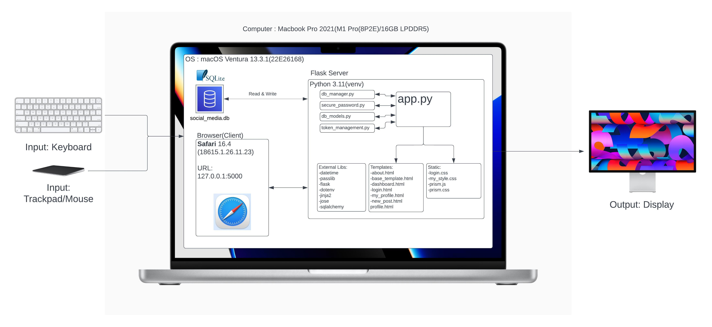
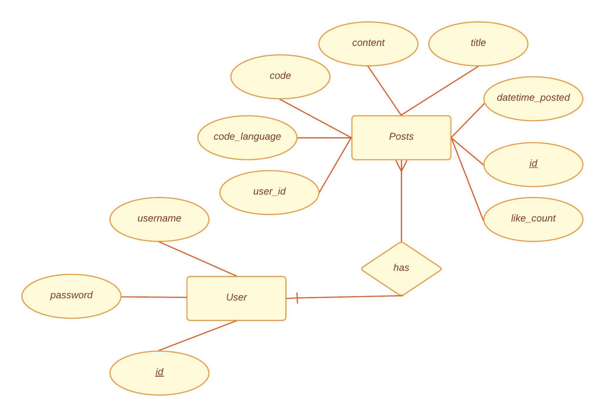
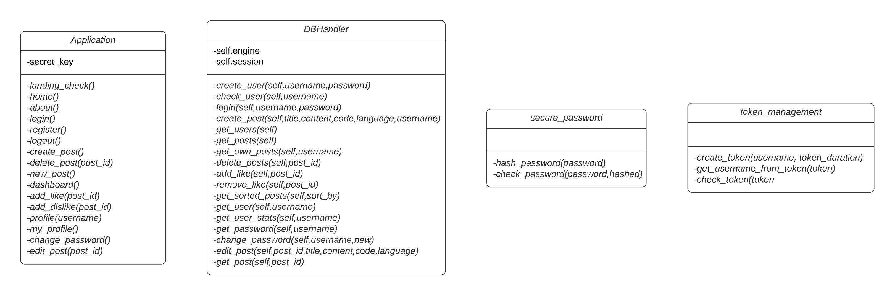

# Unit 4 Project: Code Sharing Social Media

[^1]

[^1]: "a japanese person suffering in coding in front of a laptop in the form of an oil painting" by DALL E 2, Open AI, Accessed 9th April 2023

## Criteria A: Planning

## Problem definition(Client identification)

I am a student at a high school in Karuizawa. Me and a half of my grade take Computer Science as a subject in the International Baccalaureate Diploma Programme. We often times have to share code in class and especially outside of class. We used to rely on platforms like Google Chat and Messenger to copy and paste short pieces of code at a time. It was not a very organised and effective solution as it made crediting code hard. Not to mention, sharing code over chat platforms make it very hard to add description to the code without making the chat very long and inlegible for looking back. Everyone posts their code in the community as well which makes it hard for other users to differentiate between good, working code and code that needs fixing. As such, there was a need for an consolidated solution for everyone in my class to share code and the class decided on a social media styled website that could represent code with correct syntax formatting and indentations shown.

## Proposed Solution

Considering the client's requirements, an adequate solution would be social-media styled website that can store data inside a database. The most common tools for web development are Javascript, HTML, CSS[^8]but Javascript is a client-side language, which means that code is executed on the user's browser. This can make it vulnerable to attacks like cross-site scripting (XSS). To remedy this, Python would be an adequate programming language for that as it is not a client-side language, open sourced, mature and excells at memory management[^2]. To host the webiste, Flask would be an adequate choice as it is highly scalable, making it fit to the client's need for a school use website without overcomplicating resources[^3].For the database, SQLite would be a good fit as the data we are fitting is not very large in number and SQLite, with its embedded,serverless nature[^4], can reduce the use of computing resources while running the website, not to mention higher speeds. To interface with the SQLAlchemy is the choice to go as it has improved performance and is protected against security attacks[^5]. As for the user interface for the website, Bootstrap 5 is recommended for its dynamic scaling abilites to scale automatically for different devices[^6].To keep the website and their users secure, JSON web tokens are used because they are resistant to security attacks[^7] and can prevent malicious users from modifying the key to access unauthorized content.

[^2]: Python Geeks. “Advantages of Python: Disadvantages of Python.” Python Geeks, 26 June 2021, https://pythongeeks.org/advantages-disadvantages-of-python
[^3]: “6 Reasons Why Flask Is Better Framework for Web Application Development.” *Able*, https://able.bio/hardikshah/6-reasons-why-flask-is-better-framework-for-web-application-development--cd398f73.
[^4]: S, Ravikiran A. “What Is Sqlite? and When to Use It?” *Simplilearn.com*, Simplilearn, 16 Feb.2023, https://www.simplilearn.com/tutorials/sql-tutorial/what-is-sqlite.

[^5]:  Uwase, Ange. “Here Is the Reason Why SQLAlchemy Is so Popular.” Medium, 8 Feb.2021,https://towardsdatascience.com/here-is-the-reason-why-sqlalchemy-is-so-popular-43b489d3fb00#:~:text=SQLAlchemy%20is%20the%20ORM%20of.

[^6]: Pratikasha Shinde. “6 Reasons to Use Bootstrap 5 for Better UI Development – Blog.” *Jade Global*, 6 Oct. 2021, https://www.jadeglobal.com/blog/6-reasons-use-bootstrap-5-better-ui-development.
[^7]: “What Is JWT?: Akana by Perforce.” *Akana*, https://www.akana.com/blog/what-is-jwt#:~:text=Why%20Use%20JWT%3F,was%20signed%20by%20the%20issuer.
[^8]: “11 Most in-Demand Programming Languages in 2023.” *Berkeley Boot Camps*, 5 Jan. 2023, https://bootcamp.berkeley.edu/blog/most-in-demand-programming-languages/. 

**Design statement**

## Success Criteria

1. The website must keep users seperately with an encrypted login system
1. The website must be able to represent code with the correct syntax highlighting for the appropriate language and the correct indentations
1. The website must allow posting of code and comments
1. Users should be able to like/dislike certain posts to increase authenticity of posted content
1. The website will be able to sort the posts by user/amount of likes/time posted
1. The website should allow for the changing of passwords per user

# Criteria B: Design

## System Diagram

​	

**Fig.1** *System diagram of the Website*

## Data Storage

**Fig.2** *ER diagram of the Website

## UML Diagram

**Fig.3** *UML Diagram of the website

## Wireframe

**Fig.4** *Wireframe of the website*

## Record of Tasks

| Task No | Planned Action | Planned Outcome | Time estimate | Target completion date | Criterion |
| ------- | -------------- | --------------- | ------------- | ---------------------- | --------- |
| 1       |                |                 | 1 hr          |                        | A         |

## Flow Diagrams

## Test Plan

| Type | Description | Process | Anticipated Outcome |
| ---- | ----------- | ------- | ------------------- |
|      |             |         |                     |

# Criteria C: Development

## Existing Tools

| Software/Development Tools | Coding Structure Tools      | Libraries    |
| -------------------------- | --------------------------- | ------------ |
| PyCharm                    | Object Oriented Programming | Datetime     |
| VS Code                    | SQL requests                | Flask        |
| Python                     | Databases                   | Jinja2       |
| Javascript                 | Encryptions                 | Passlib.hash |
| HTML                       | For Loops                   | dotenv       |
| CSS                        | If-then-else statements     | Jose         |
| SQLite                     | Object Relation Mapping     | Sqlalchemy   |
| SQLAlchemy                 |                             |              |
| JSON Web Tokens            |                             |              |
| Flask                      |                             |              |
| Bootstrap 5                |                             |              |
| ChatGPT                    |                             |              |
| Github Copilot             |                             |              |

## List of techniques used

1. 

# Criteria D: Functionality

## Demonstration Video

[Click here for the Video]()

# Criteria E: Evaluation

# Appendix

