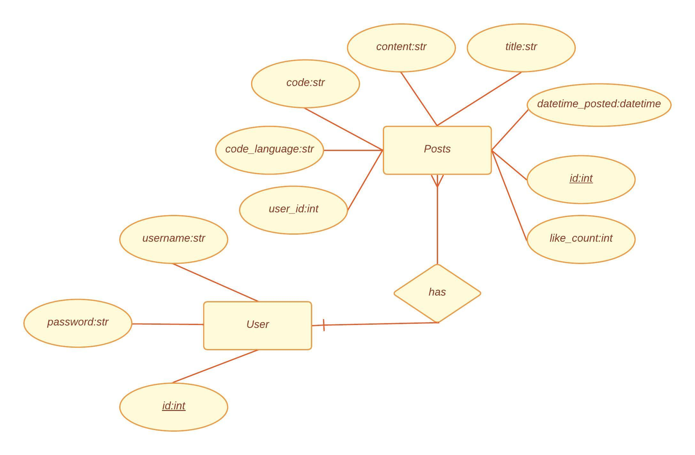
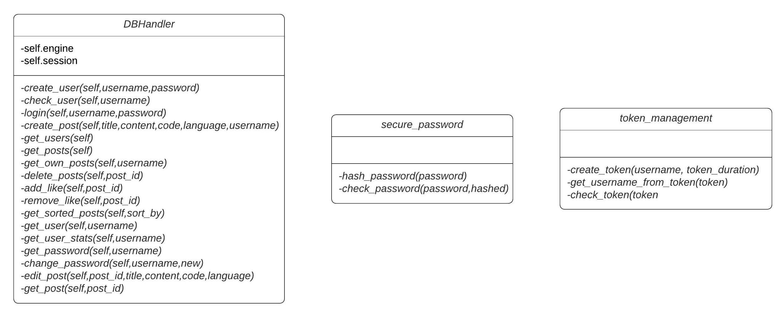
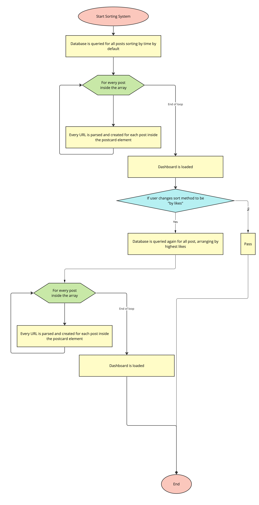
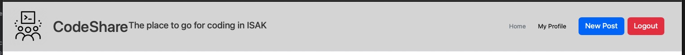
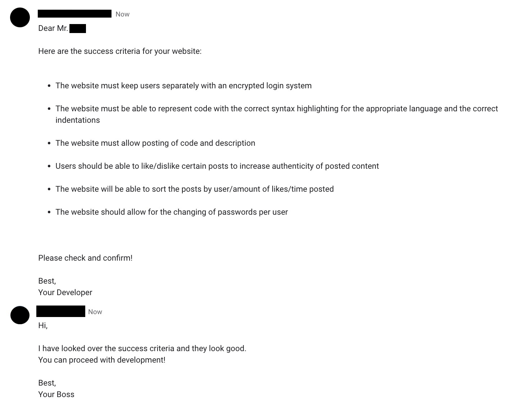
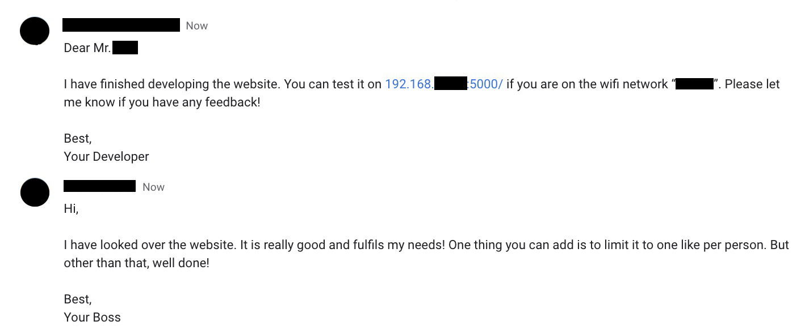

# Unit 4 Project: Code Sharing Social Media

[^1]

[^1]: "a japanese person suffering in coding in front of a laptop in the form of an oil painting" by DALL E 2, Open AI,
Accessed 9th April 2023

## Criteria A: Planning

## Problem definition(Client identification)

I am a student at a high school in Karuizawa. Me and a half of my grade take Computer Science as a subject in the
International Baccalaureate Diploma Programme. We often have to share code in class and especially outside of
class. We used to rely on platforms like Google Chat and Messenger to copy and paste short pieces of code at a time. It
was not a very organised and effective solution as it made crediting code hard. Not to mention, sharing code over chat
platforms makes it very hard to add description to the code without making the chat very long and illegible for looking
back. Not to mention, the indentation of code gets confused when sent to chat applications; syntax highlighting is
non-existent altogether. We have limited amounts of secure and organised platforms to connect about code between the
community. Everyone posts their code in the community as well which makes it hard for other users to differentiate
between good, working code and code that needs fixing.(See evidence of consultation in Appendix 1)

## Proposed Solution

Considering the client's requirements, an adequate solution would be social-media styled website that can store data
inside a database. The most common tools for web development are Javascript, HTML, CSS[^8]but Javascript is a
client-side language, which means that code is executed on the user's browser. This can make it vulnerable to attacks
like cross-site scripting (XSS). To remedy this, Python would be an adequate programming language for that as it is not
a client-side language, open sourced, mature and excels at memory management[^2]. To host the website, Flask would be
an adequate choice as it is highly scalable, making it fit to the client's need for a school use website without
overcomplicating resources[^3].For the database, SQLite would be a good fit as the data we are fitting is not very large
and SQLite, with its embedded,serverless nature[^4], can reduce the use of computing resources while running the
website, not to mention higher speeds. To interface with the SQLAlchemy is the choice to go as it has improved
performance and is protected against security attacks[^5]. As for the user interface for the website, Bootstrap 5 is
recommended for its dynamic scaling abilities to scale automatically for different devices[^6].To keep the website and
their users secure, JSON web tokens are used because they are resistant to security attacks[^7] and can prevent
malicious users from modifying the key to access unauthorized content.

[^2]: Python Geeks. “Advantages of Python: Disadvantages of Python.” Python Geeks, 26 June
2021, https://pythongeeks.org/advantages-disadvantages-of-python
[^3]: “6 Reasons Why Flask Is Better Framework for Web Application Development.”
*Able*, https://able.bio/hardikshah/6-reasons-why-flask-is-better-framework-for-web-application-development--cd398f73.
[^4]: S, Ravikiran A. “What Is Sqlite? And When to Use It?” *Simplilearn.com*, Simplilearn, 16
Feb.2023, https://www.simplilearn.com/tutorials/sql-tutorial/what-is-sqlite.
[^5]:  Uwase, Ange. “Here Is the Reason Why SQLAlchemy Is so Popular.” Medium, 8
Feb.2021,https://towardsdatascience.com/here-is-the-reason-why-sqlalchemy-is-so-popular-43b489d3fb00#:~:text=SQLAlchemy%20is%20the%20ORM%20of.
[^6]: Pratikasha Shinde. “6 Reasons to Use Bootstrap 5 for Better UI Development – Blog.” *Jade Global*, 6 Oct.
2021, https://www.jadeglobal.com/blog/6-reasons-use-bootstrap-5-better-ui-development.
[^7]: “What Is JWT?: Akana by Perforce.”
*Akana*, https://www.akana.com/blog/what-is-jwt#:~:text=Why%20Use%20JWT%3F,was%20signed%20by%20the%20issuer.
[^8]: “11 Most in-Demand Programming Languages in 2023.” *Berkeley Boot Camps*, 5 Jan.
2023, https://bootcamp.berkeley.edu/blog/most-in-demand-programming-languages/.

### Design statement

I will design a social media platform on a website built with Flask, Bootstrap, HTML, and CSS which stores data in an
SQLite database for me and my classmates. This website will allow me and my classmates to post code and descriptions of
them accordingly, with a like/dislike system to moderate content. It will take approximately 1 month to complete and
will be evaluated according to the criteria below:

## Success Criteria

1. The website must allow user registration for personal accounts secured with a token system *(Issue tackled: "We have
   limited amounts of secure and organised platforms")*
2. The website must be able to represent code with the correct syntax highlighting for the appropriate language and the
   correct indentations *(Issue tackled: "The indentation of code gets confused when sent to chat applications, syntax
   highlighting is non-existent altogether.")*
3. The website must allow posting of code and description *(Issue tackled: "Sharing code over chat platforms make it
   very hard to add description to the code")*
4. Users should be able to like/dislike certain posts to differentiate the quality of code posted *(Issue tackled: "Everyone
   posts their code in the community as well, which makes it hard for other users to differentiate between good, working
   code and code that needs fixing.")*
5. The website will be able to sort the posts by user/number of likes/time posted *(Issue tackled: "We have limited
   number of secure and organised platforms" and "Making the chat very long and illegible for looking back")*
6. The website should allow for the changing of passwords per user *(Issue tackled:"We have a limited number of secure
   and organised platforms")*

# Criteria B: Design

## System Diagram

​    

**Fig.1** *System diagram of the Website*

## Data Storage



**Fig.2** *ER diagram of the Website*

### Example of Data Entries


**Fig.3** *Example of data entry in the Post table*


**Fig.4** *Example of data entry in the User table*

## UML Diagram



**Fig.5** *UML Diagram of the website*

## Wireframe


**Fig.6** *Wireframe of the website*

## Record of Tasks

| Task No | Planned Action                                            | Planned Outcome                                                                                                     | Time estimate | Target completion date | Criterion |
|---------|-----------------------------------------------------------|---------------------------------------------------------------------------------------------------------------------|---------------|------------------------|-----------|
| 1       | Planning: First Meeting with client                       | Start collecting the context of the problem and research on current solutions                                       | 3min          | Mar 28                 | A         |
| 2       | Planning: Defining problem and proposed solution          | Start on refining client's requirements and tools needed                                                            | 2 hr          | Mar 29                 | A         |
| 3       | Initializing codebase                                     | To have the base environment of program ready for coding                                                            | 1 hr          | Mar 29                 | B         |
| 4       | Planning : Second Meeting with client                     | Decided success criteria(See Appendix 2)                                                                            | 5 min         | Mar 30                 | A         |
| 5       | Planning: Creating Wireframe                              | To have Wireframe diagram finished                                                                                  | 1 hr          | Apr 1                  | B         |
| 6       | Development: Coding the structure of the database         | Finalize on the structure of the database                                                                           | 10min         | Apr 2                  | C         |
| 7       | Development: Initializing db_manager                      | To have a base for the database handler coded and ready for new functions to be coded on top                        | 10min         | Apr 2                  | C         |
| 8       | Development: Coding basic endpoints                       | To have basic endpoint coded                                                                                        | 15min         | Apr 2                  | C         |
| 9       | Development: Coding the token manager                     | To have the JWT system implement as a base for my flask application                                                 | 45min         | Apr 2                  | C         |
| 10      | Development: Coding the Login/Registration  backend       | To have the backend database logics implemented for the user management                                             | 20min         | Apr 3                  | C         |
| 11      | Development: Coding the login page                        | To design the login page for the website, complete with the registration function as well                           | 1hr           | Apr 3                  | C         |
| 12      | Development: Coding Header/Footer                         | To have the header/footer of the website designed and coded                                                         | 20min         | Apr 4                  | C         |
| 13      | Development: Coding Dashboard                             | To have the layout of the dashboard page coded                                                                      | 30min         | Apr 4                  | C         |
| 14      | Development: Coding New Post                              | To have the layout of the new post page coded                                                                       | 30min         | Apr 5                  | C         |
| 15      | Development: Coding My Profile                            | To have the layout of the my profile page coded                                                                     | 30min         | Apr 5                  | C         |
| 16      | Development: Coding logic for Dashboard                   | To have the dashboard page connected to the database logic                                                          | 45min         | Apr 6                  | C         |
| 17      | Development: Coding logic for New Post                    | To have the new post page connected to the database logic                                                           | 45min         | Apr 7                  | C         |
| 18      | Development: Coding logic for My Profile                  | To have the my profile page connected to the database logic                                                         | 45min         | Apr 8                  | C         |
| 19      | Development: Coding the Syntax Highlighting for code      | To have the plugin for syntax highlighting code implemented properly                                                | 1hr           | Apr 9                  | C         |
| 20      | Development: Coding the logic for "other" code languages  | To have the function for other code language other than the listed one to be catered for                            | 20min         | Apr 9                  | C         |
| 21      | Development: Coding Rating System                         | To have the the like and dislike button connect with the backend database                                           | 30min         | Apr 10                 | C         |
| 22      | Development: Coding Changing Password                     | To have the change passwords function coded                                                                         | 15min         | Apr 11                 | C         |
| 23      | Implementation: Beta Testing                              | To have feedback from client to know how to improve                                                                 | 1hr           | Apr 11                 | C         |
| 24      | Development: Coding Delete Confirmation                   | To have the feedback from client's beta testing implemented                                                         | 15min         | Apr 11                 | C         |
| 25      | Development: Consolidating Code into `base_template.html` | To reduce repetitive code and centralize the dependencies for the website                                           | 1hr           | Apr 12                 | C         |
| 26      | Planning: Creating System Diagram                         | To have understanding of the computer systems required for the completing the success criteria                      | 30min         | Apr 13                 | B         |
| 27      | Planning: Creating UML Diagram                            | To have understanding of the different parts of the code                                                            | 30min         | Apr 13                 | B         |
| 28      | Planning: Creating ER Diagram                             | To have the structure of the database documented                                                                    | 30min         | Apr 13                 | B         |
| 29      | Planning: Creating Flow Diagrams                          | To have a clear understanding of difficult parts of code                                                            | 1hr           | Apr 14                 | B         |
| 30      | Development: Cleaning up Code                             | To have the code finalized and organized for easy-understanding                                                     | 10min         | Apr 16                 | C         |
| 31      | Planning: Creating Test Plan                              | To have a test plan created for confirming if the application works to standard                                     | 30min         | Apr 16                 | B         |
| 32      | Implementation: Evaluation by client                      | To have the website evaluated by the client and the subsequent evidence documented                                  | 1hr           | Apr 19                 | E         |
| 33      | Beta Testing: Evaluation by peer                          | To have the website evaluated by a peer and the subsequent evidence documented                                      | 1hr           | Apr 19                 | E         |
| 34      | Implementation: Collect Recommendations from users/client | To have taken in recommendations from both evaluations on how the website can be improved and document them properly | 15min         | Apr 19                 | E         |

## Flow Diagrams

### Token System


**Fig.7** *Flow Diagram of the token system* This diagram shows how users can authenticate in my website with JWT with
expiry time. This ensures that users' data is kept safe and no unauthorized access would occur.

### Sorting



**Fig.8** *Flow Diagram of sorting system* This flow diagram demonstrates the ability to sort posts by different
metrics.

### Like System

 

**Fig.9** *Flow diagram for adding and removing likes* This flow diagram demonstrates how the system for adding
like/dislike works.

## Test Plan

| Type                 | Description                | Process                                                                                                                                                                                                                                                                      | Anticipated Outcome                                                                                                                                                                                              |
|----------------------|----------------------------|------------------------------------------------------------------------------------------------------------------------------------------------------------------------------------------------------------------------------------------------------------------------------|------------------------------------------------------------------------------------------------------------------------------------------------------------------------------------------------------------------|
| Unit Testing         | User Registration          | 1.Open Website<br/>2.Click on the register button<br/>3.Put "johndoe" as the username and "johndoelovescake" for both password fields<br/>4. Click the register button on the modal.                                                                                         | The modal should disappear and a flash message if stating that the user has been registered successfully.                                                                                                        |
| Unit Testing         | User Login                 | 1.Open Website<br />2. Put "johndoe" as the username and "johndoelovescake" as the password<br />3. Click the login button on the login card                                                                                                                                 | The user should be redirected to the dashboard page of the page if the user exists and the password matches the hash in the database.                                                                            |
| Unit Testing         | Logout                     | 1.Open Website<br />2.Login using the same credentials as above<br />3.Click the log out button on the top bar                                                                                                                                                               | The user should be redirected back to the login screen and the session token should be removed from the session storage if checked using "Inspect"                                                               |
| Integration Testing  | Login and Registration     | 1.Open Website<br />2.Follow the instructions for registering a user above<br />3. Follow the instructions for logging in above using the same credentials that was registered with<br />                                                                                     | If the user followed the instructions properly and registered for a user, then the user should be able to login with the same credentials that were just registered with.                                        |
| Unit Testing         | Changing Password          | 1.Open Website<br />2.Login<br />3.Click on the my profile button on the header<br />4.Click the change password button<br />5. Input the current password of the current user and put "changeme" for new and confirm password<br />6.Click Confirm                          | If the user followed the instructions properly and no errors occurred in the process, then the user should be able to logout and log back into the same user with the same username but with password "changeme". |
| Unit Testing         | Adding new post            | 1.Open Website<br />2.Login<br />3.Click New Post on the header<br />4.Put in "Hello World Testers!" as the title, "This is a test to the program" as the Content, "swift" as the language and `print(Hello /(tester.username))` as the code.<br />5.Click the submit button | The user should be redirected to their own profile page, where they can see their own posts, including the one they just posted.                                                                                 |
| Unit Testing         | Like/Dislike a post        | 1.Open Website<br />2.Login<br />3.Click on the like button of a post<br />4.Click on the dislike button of another post                                                                                                                                                     | The user should be able to see the like count of the post increase by 1 for the first post and decrease by 1 for the second one.                                                                                 |
| Integration Testing | Adding Post / Viewing Post | 1.Open Website<br />2.Login<br />3.Create a new post following the instructions above<br />4.Click the home button                                                                                                                                                           | The user should be able to see the post they just created on the top of the dashboard.                                                                                                                           |
| Unit Testing         | Sorting System             | 1.Open Website<br />2.Login<br />3.Change the sorting method to by like on the dashboard using the dropdown on the right                                                                                                                                                     | The user should be able to see posts sorted by the highest like count.                                                                                                                                           |
| Code Review          | Reviewing Code             | Going through the code and making sure unused parts are removed, variables are named properly and comments are placed appropriated                                                                                                                                           | Easy to understand and easy to debug code for future development.                                                                                                                                                |

# Criteria C: Development

## Existing Tools

| Libraries    |
|--------------|
| Datetime     |
| Flask        |
| Jinja2       |
| Passlib.hash |
| dotenv       |
| Jose         |
| Sqlalchemy   |
| Prism.js     |

## References

### [Bootstrap 5 Documentation](https://getbootstrap.com/docs/5.3/getting-started/introduction/)

Bootstrap 5's official documentation is what I referenced regarding UI elements of my website.
Snippets of code for
modals, cards, headers and footer have been taken from the documentation and have been since modified to fit the needs
of the current application

### [ChatGPT](chat.openai.com)

ChatGPT is a large language model developed by OpenAI, based on the GPT (Generative Pre-trained Transformer)
architecture.
It helps me with logics in code and pseudocode for parts like HTML and jinja

***Disclaimer*** *No part of this program includes code blocks directly copied from ChatGPT*

**[Github Copilot X](https://github.com/features/preview/copilot-x)**

GitHub Copilot is an AI-powered code completion tool developed by GitHub in collaboration with OpenAI.
It uses machine
learning algorithms trained on a vast corpus of code to suggest code snippets, functions, and even entire classes based
on the context of what the developer is writing.
It has helped me explain my code and syntax reformatting on HTML and
Python

***Disclaimer*** *No part of this program includes code blocks directly generated by Github Copilot*

## List of Techniques

1. Object-Oriented Programming(OOP)
2. Object Relation Mapping(ORM): SQLAlchemy
3. Flask Library/Routes
4. Javascript/Python inside HTML
5. CSS Styling
6. For loops for showing posts
7. if statements
8. Password Hashing
9. Token-based authentication
10. Interacting with Databases
11. Arrays and Lists
12. Text Formatting
13. DRY Programming Technique

## Development

### Cards

When researching about social media website designs, I noticed that most websites prefer a card based designed to better
guide the user and make the overall interface clearer for reading.
Thus, I chose to employ a card-based design for my
login screen.
Here is the code snippet:

```html

<div class="card" style="width: 18rem;">
    {# Code of the sign in fields inside the card is omitted for demonstration purposes#}
</div>
```

As you can see above, the whole sign in form is house inside a `<div>` element which inherits from class `card` from the
bootstrap library. This automatically houses the elements inside the `<div>` align to the center and automatically
creates a border for the sign in form so the user's attention is immediately grabbed towards it


**Fig.10**  *Screenshot of the login page, as mentioned above this employs a card design in order to reduce clutter on
the screen and lead the user to the most important element which is the login fields.*

### Modals

Throughout this program,
the input of certain information is often needed in instances
stated in the success criteria like registering new users,
changing passwords, and editing posts.
If we redirect the user to a new page everytime one of those actions are being executed,
the website will become very cluttered and unintuitive.
As such,
I have chosen
to use a modal which is a web page element that displays in front of and deactivates all other page content.
To return to the main content, the user must engage with the modal by completing an action or by closing it.
Modals are often used to direct users’
attention to an important action or piece of information on a website or application.
For example, when the user clicks on the change password button, it triggers a modal with the following code:

```html

<button type="button" class="btn btn-primary w-100" data-bs-toggle="modal" data-bs-target="#changePasswordModal">
```

When the button is defined, it is set to toggle the modal defined below:

```html

<div class="modal fade" id="changePasswordModal" tabindex="-1" aria-labelledby="changePasswordModalLabel"
     aria-hidden="true">
    <div class="modal-dialog">
        {# Code omitted for demonstrative purposes#}
    </div>
</div>
```

The modal is created by inheriting from the `modal` class from the Bootstrap 5 library. Inside the modal, we can house
ordinary html elements like forms and text fields.


**Fig.11**  *Screenshot of the modal pop up.*

As you can see, the content around the modal is darkened and directs the user's attention there. This same concept is
also applied to when the client said they wanted a confirmation before deleting the post in the first round of beta
testing.

### JSON Web Tokens (Success Criteria #1)

One of the success criteria was to have a hashed login system.
One issue I had after the user logged in which was that I could not recognize the user after the initial login process.
I wanted to use cookies to store the user ids.
I realized soon afterwards that the cookies can be easily modified in flight and makes the hashed passwords useless.
Soon I came across session tokens.
Session tokens are encrypted token that contain information about the user.
They expire after a time designated by the developer
and can be used to protect the user as it is hashed using a special secret key that only the developer has control over.
Currently, once the user successfully logs in with the right username and password.
The main key function on the flask endpoint executes a `create_token` function from the `token_management.py`.
The token is created as follows:

```py
# This functions takes in the username and the how long the token should last in minutes
def create_token(username, token_duration):
    # This adjusts the starting time of counting the token expiry to keep consistency across platforms
    unix_timestamp = (datetime.now() - datetime(1970, 1, 1)).total_seconds()
    # This line sets the expiry time of the token
    ttl = token_duration * 60 + unix_timestamp
    # token format = encoded(username, datetime) token_duration in minutes
    token = jwt.encode({'username': username, 'datetime': ttl}, token_encryption_key, algorithm='HS256')
    # Token is returned to the main flask function
    return token
```

After the main function receives the token from the `create_token` function, its gives the token back to the client by
putting it into the session variable of the browser as follows:

```py
session['token'] = create_token(username, 120)
```

Now, the user holds the token in their browser. When they want to execute an action, the backend tries to get the token
from the browser as follows:

```py
@app.route("/new_post", methods=['GET', 'POST'])
def new_post():
    try:
        token = session['token']
    except KeyError:
        return redirect(url_for('login'))
    # Continues function
```

On the code above, I used the `try` statement to handle `KeyError` in the instance that the JWT is not present in the
user's browser and redirects them to the login page. If the token is present, the validity of it is checked using
a `check_token` function. It decodes the token and checks if the expiry time has exceeded current time as follows:

```py
def check_token(token):  # check if token is valid and not expired
    try:
        # Decodes token using predefined key and algorithm
        decoded_token = jwt.decode(token, token_encryption_key, algorithms=['HS256'])
        current_time = datetime.utcnow().timestamp()
        # Compares expiry time and current time
        if decoded_token['datetime'] < current_time:
            return False
        else:
            return True
    except Exception:
        return False
```

The main function then receives a boolean value of whether the user is valid in an active session
and lets them proceed with the desired action.
This system closes the loophole of modifying cookies and completes the hashed authentication system criteria.

### Header and Footers

To keep a consistent look through out the website and to let users easy navigate through different elements. A header
and footer is added to the website to keep a structure in between pages and to make sure the user does not get lost while
interacting with different elements of the website. A header is added to the page with the `<header>` tag in html and to
add a footer the `<footer>` tag is used. The header code is showing below to demonstrate:

```html

<header class="p-3 mb-3 border-bottom fixed-top"
        style="width: 100%; display: flex; justify-content: space-between; background-color: #d9d9d9;">
    <div class="d-flex align-items-center">
        <a href="/" class="d-flex align-items-center mb-2 mb-lg-0 link-body-emphasis text-decoration-none">
            
            <h1 class="ms-3 mb-0">CodeShare</h1><h4>The place to go for coding in ISAK</h4>
        </a>
    </div>
    <div class="d-flex align-items-center">
        <ul class="nav me-3">
            <li class="nav-item">
                <a class="nav-link link-secondary" href="/dashboard">Home</a>
            </li>
            <li class="nav-item">
                <a class="nav-link link-body-emphasis" href="/my_profile">My Profile</a>
            </li>
        </ul>
        <div class="d-flex" style="padding-right: 30px">
            <a href="/new_post">
                <button type="button" class="btn btn-primary me-2 btn-lg">New Post</button>
            </a>
            <a href="/logout">
                <button type="button" class="btn btn-danger btn-lg">Logout</button>
            </a>
        </div>
    </div>
</header>
```

As seen above, the `<header>` tag is used to house the elements inside the top bar of the website. With elements like
the website icon, title and the logout button housed inside, a bar that keeps coherence between pages and guides the
user. It looks like:



**Fig.12**  *Screenshot of header.*

### Base Template(Pattern Recognition/Generalization/Abstraction)

As the header and footer needs to be present in every single page,
it constructs a lot of repetition and boilerplate code in my program.
Boilerplate code is referring to parts of code that has to be repeatedly be used with no or a little modification.
This is especially present in HTML as it is declarative language.
If the code for the header and footer is repeated every time a new page is needed,
it would make my code very repetitive
and make it hard
when I have to change one thing in the header or the footer as I have to change it in every file seperately.
Thus, I decided to used a template file, where the header and footer is housed inside one file only,
and other files extends from this base file to add their own respective content.
The base file starts out like a normal html file with the necessary scripts and CSS files imported,
but in the main body, only one line is added:

```html

```

This line opens up a variable called `content` in the base template. On the other files, it is indicated on the first
line that the file is extending the base file:

```html

```

After that the child file can add content into the variable with the same line:

```html

{# Normal HTML for the main body of the page. Omitted here because of length#}

```

When this html file is loaded on the browser, the base file is taken and the variables from the child file is being
stitched together automatically into one single HTML file. That way, if I need to change anything on the header/footer
or change out dependencies, improving efficiency and future development upgradibility.

### Posts Representation (Success Criteria #3)

To show posts, it is a repetitive / boilerplate code,
thus I used the `jinja2` extension for HTML to add a logic functions into my HTML code.
On load of the website after successful authentication, the database is queried for posts and an array of posts.
The data is then passed through to the HTML for representation.
The first thing the HTML checks for is if there is any posts that needs to be shown by the `{if posts}`clause.
If posts has any object in it,
a for loop `{for post in posts}` is used to loop through the posts
and draw them onto the screen using a defined set of elements.
Here is the full code:

```html

<div class="card mb-3">
    <div class="card-body">
        <h2 class="card-title">{{ post.title }}</h2>
        <h6 class="card-subtitle mb-2 text-muted"><a href="/profile/{{ post.username }}">{{ post.username }}</a> - {{
            post.datetime_posted }}</h6>
        <p class="card-text">{{ post.content }}</p>
        <pre><code class="language-{{ post.code_language }}">{{ post.code }}</code></pre>
    </div>
    <div class="card-footer d-inline-flex justify-content-start mt-auto">
        <h3> Was this helpful?
            <a href="/add_like/{{ post.id }}">
                <button type="button" class="btn btn-outline-success btn-sm w-auto">
                    <i class="bi bi-hand-thumbs-up"></i> +
                </button>
            </a>
            <span class="badge bg-secondary">{{ post.like_count }}</span>
            <a href="/add_dislike/{{ post.id }}">
                <button type="button" class="btn btn-outline-danger btn-sm w-auto">
                    <i class="bi bi-hand-thumbs-down"></i> -
                </button>
            </a>
        </h3>
    </div>
</div>

```

As you can see, the for loop needs a `{endfor}` argument as it repeats all the html code inside the for loop for each
post object when the page is loaded. Here is a screenshot of the posts:


**Fig.13**  *Screenshot of posts.*

### Code Representation - Syntax Highlighting (Success Criteria #2)

One key thing of the social media that my client wants is the accurate representation of code with appropriate syntax
highlighting and indentations. To address this, I chose to use a lightweight javascript interpreter for the code called
Prism.js. To use this in my html, the code is shown with:

```html

<pre><code class="language-{{ post.code_language }}">{{ post.code }}</code></pre>
```

As seen here, the language of the code is needed to highlight the syntax properly as there is no way to interpret the
language of the code given in such a small program. Thus, a column in the post table of the database is dedicated to
storing the language of the code. The code is then housed inside the `<code>` tag and is picked up by the prism
javascript file and formatted.

### Like/Dislike System (Success Criteria 4)

Another thing my client wanted was a way to rank the posts based on how helpful they are. To do this, I added a
like/dislike system to the posts. The like/dislike system is implemented by adding a like/dislike count to each post.
When the user clicks on the like/dislike button, the count is updated in the database and the page is reloaded to show
the updated count. The code for the like/dislike system is shown below:

```html

<h3> Was this helpful?
    <a href="/add_like/{{ post.id }}">
        <button type="button" class="btn btn-outline-success btn-sm w-auto">
            <i class="bi bi-hand-thumbs-up"></i> +
        </button>
    </a>
    <span class="badge bg-secondary">{{ post.like_count }}</span>
    <a href="/add_dislike/{{ post.id }}">
        <button type="button" class="btn btn-outline-danger btn-sm w-auto">
            <i class="bi bi-hand-thumbs-down"></i> -
        </button>
    </a>
</h3>
```

### Sorting System(Algorithms) (Success Criteria #5)

With the like/dislike system, the users can sort the posts by the most helpful posts.
To do this, I implemented a sorting algorithm that sorts the posts by the like count.
The sorting algorithm is implemented in the `get_sorted_posts()` function in the `db_manager.py` file.
The sorting algorithm is a simple sort algorithm that sorts the posts by the like count.
There is a button on the dashboard of the website
that can let users choose between sorting posts by time or by the amount of likes.
The code to get the option from the user is shown below:

```python
@app.route("/dashboard")
def dashboard():
    try:
        token = session['token']
        if check_token(token):
            username = get_username_from_token(token)
            sort_by = request.args.get('sort_by', default='time', type=str)
            posts = db.get_sorted_posts(sort_by)
            return render_template('dashboard.html', title='Dashboard', posts=posts, username=username)
        else:
            return redirect(url_for('login'))
    except KeyError:
        return redirect(url_for('login'))
```

As you can see, the `sort_by` variable is set to `time` by default. If the user chooses to sort by likes, the `sort_by`
variable is set to `likes`. The `sort_by` variable is then passed to the `get_sorted_posts()` function in
the `db_manager.py` file. The `get_sorted_posts()` function is shown below:

```python
    def get_sorted_posts(self, sort_by):
    posts = None
    if sort_by == "time":
        posts = self.session.query(Post).order_by(Post.datetime_posted.desc()).all()
    elif sort_by == "likes":
        posts = self.session.query(Post).order_by(Post.like_count.desc()).all()
    if posts:
        for post in posts:
            user = self.session.query(Users).filter_by(id=post.user_id).first()
            post.username = user.username
            # post.datetime_posted = post.datetime_posted.strftime("%d/%m/%Y %H:%M")
        return posts
```

### Changing of Passwords(Decomposition) (Success Criteria #6)

One other thing that my client wanted was a way to change their passwords. To do this, I implemented a change password
function that allows the user to change their password. The change password function is implemented in
the `/change_password` endpoint in the `app.py` file. The change password function is shown below:

```python
 if secure_password.check_password(current, db.get_password(username)):
    if new == confirm:
        db.change_password(username, new)
        flash(('Password changed successfully.', "success"))
        return redirect(url_for('my_profile'))
    else:
        flash(('New passwords do not match', "danger"))
        return redirect(url_for('my_profile'))
else:
flash(('Current password is incorrect', "danger"))
return redirect(url_for('my_profile'))
```

As you can see, the change password function checks if the current password is correct, then checks if the new password
and the confirm password are the same. If both are true, the password is changed in the database and the user is
redirected to their profile page. If either of the conditions are false, the user is redirected to their profile page
with an error message. The change password function is implemented in the `db_manager.py` file. The change password
function is shown below:

```python
    def change_password(self, username, new):
    user = self.session.query(Users).filter_by(username=username).first()
    user.password = hash_password(new)
    self.session.commit()
    return
```

As you can see, the change password function hashes the new password and updates the password in the database.

### Initializing Database/Inserting placeholder Data

Throughout the development of the website, I had to initialize the database and insert dummy data into the database. To
do this, I implemented a function that initializes the database and inserts dummy data into the database. The function
is implemented in the `db_init.py` file. The code is shown below:

```python
db = DBHandler("sqlite:///social_media.sqlite")
## Create tables
Base.metadata.create_all(db.engine)


def dummy_insert_user():
    users = ["alice123", "bob123"]
    passwords = ["alice123", "bob123"]
    for user, password in zip(users, passwords):
        new_user = Users(username=user, password=hash_password(password))
        db.session.add(new_user)
    db.session.commit()


def dummy_insert_post():
    titles = ["First Post", "Second Post"]
    contents = ["This is my first post", "This is my second post"]
    codes = ["print('Hello World')", "SELECT * FROM users"]
    code_languages = ["python", "sql"]
    user_ids = [1, 2]
    for title, content, code, user_id, code_languages in zip(titles, contents, codes, user_ids, code_languages):
        new_post = Post(title=title, content=content, code=code, code_language=code_languages, user_id=user_id)
        db.session.add(new_post)
    db.session.commit()


dummy_insert_user()
dummy_insert_post()
```

As you can see, the function creates two users and two posts. This reduces the amount of time I have to spend on
creating dummy data for testing purposes.

# Criteria D: Functionality

## Demonstration Video

[Click here for the Video](https://drive.google.com/file/d/1EU9FcRAd8hMcryzWx1urgHR3QDPPmpq5/view?usp=share_link)

# Criteria E: Evaluation

## Evaluation by Client

| Success Criteria                                                                                                                          | Met? | Description                                                                                                     |
|-------------------------------------------------------------------------------------------------------------------------------------------|------|-----------------------------------------------------------------------------------------------------------------|
| The website must keep users separately with an encrypted login system                                                                     | Yes  | Users are secured behind a hashed login system and token system                                                 |
| The website must be able to represent code with the correct syntax highlighting for the appropriate language and the correct indentations | Yes  | The website is able to represent code with correct syntax highlighting and indentation with the prism.js module |
| The website must allow posting of code and description                                                                                    | Yes  | The website allows for posting new content via the `new_post/` endpoint                                         |
| Users should be able to like/dislike certain posts to increase authenticity of posted content                                             | Yes  | The website allows for liking/disliking for specific posts via `add_like/` and `add_dislike/` endpoints         |
| The website will be able to sort the posts by user/amount of likes/time posted                                                            | Yes  | The website allows for sorting by time and like count on the home page                                          |
| The website should allow for the changing of passwords per user                                                                           | Yes  | The website allows for changing passwords with a button on the `my_profile/` endpoint                           |

The client is very satisfied by the product(See Appendix 3), with the website meeting all the success criteria. During
beta testing, the client suggested to add a confirmation dialog for deleting posts to eliminate accidental deletion (See
Appendix 5)and that has been implemented as well. One possible improvement highlighted by the client is that one person
is limited to one like or dislike in order to prevent people from spamming the like button, removing authenticity from
the rating.

## Evaluation by Peer

My peer is very satisfied by the product(See Appendix 4), with the website meeting all the success criteria.
One possible improvement highlighted by my peer was the ability
to filter through code by the code language on the home page
as that would make it easier to sort through what they are looking for.

## Extensibility

The client was very satisfied with the final result, as it met all of his requirements. After some additional discussion
we concluded that the following future extensions could be added:

1. Commenting System - A commenting system to be added to posts as it could let other users give their own opinion with
   another piece of code. This could be done using a new table inside the database.

# Appendix


**Appendix.1** *Rough notes from first meeting with client, includes basic ideas behind problem with current solution*



**Appendix.2** *Contact between developer and client approving success criteria*



**Appendix.3** *Contact between developer and client for evaluation of website*


**Appendix.4** *Contact between developer and peer for evaluation of website*


**Appendix.5** *Contact between developer and client regarding beta testing and feedback*
